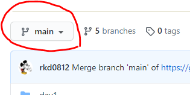
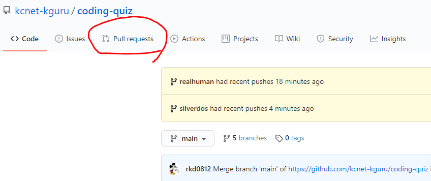

# K-GURU jr Javascript Code 코딩 퀴즈

### 깃허브에 퀴즈 올리는 법

1. git을 다운받아 설치 합니다. [:link:](https://git-scm.com/downloads)

2. github 사이트를 가서 회원 가입을 하고 관리자에게 계정을 알려줍니다.

3. 승인 되었다는 메세지를 받으면, 가입한 이메일로 가서 초대 메일에 승인을 클릭합니다.

4. cmd 창에서 작업하기를 원하는 폴더로 이동 후 다음과 같이 입력합니다.
```
$ git clone https://github.com/kcnet-kguru/jr-javascript
```

5. cmd 창에서 브랜치를 생성합니다.
```
$ git branch <branchname>
$ git checkout <branchname>
// or
// 브랜치 생성 후 체크아웃 같이 실행
$ git checkout -b <branchname>
```

6. 퀴즈 파일을 풀고 새로 생성한 파일을 커밋합니다.

```
$ git add .
$ git commit -m 'Day 퀴즈 완료'
```

7. [코딩퀴즈 깃허브페이지](https://github.com/kcnet-kguru/jr-javascript)로 접속하여 본인의 브랜치를 선택합니다.



8. 상단의 `pull request` 메뉴로 들어갑니다.



9. `New pull request` 버튼을 클릭하여, `pull request` 생성하고, `create pull request`를 클릭하여 `pull request`를 합니다.

10.   추후에 코드리뷰를 확인합니다.

